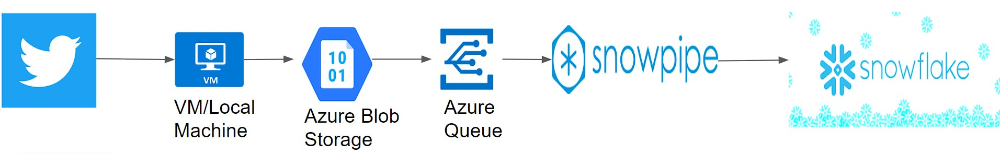

# Twitter_FeedBoard

Real-Time Twitter feed dashboard in Snowflake using Azure
## Dataset Description
We will use the Twitter API and fetch tweets and their metadata(re-tweets, comments,
likes) using Python.
## Tech Stack
* Language: Python
* Services: Azure Storage Account, Azure Queue, Snowpipe, Snowflake, Azure Resource Group